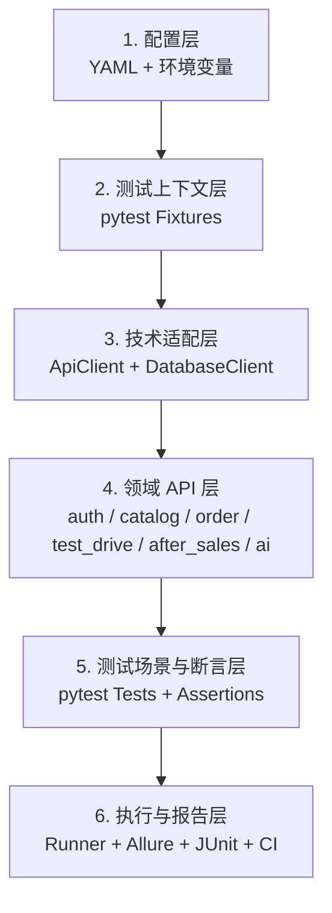

# 新能源汽车销售系统 API 自动化测试项目

> 基于 Python + pytest + requests 搭建的 API 自动化回归项目，围绕登录鉴权、车型库存、试驾预约、订单支付、售后工单和 AI 导购等真实业务场景设计。

[](https://github.com/Xdx-03/ev-sales-api/actions/workflows/suite-validation.yml)


项目以黑盒接口测试为主，不包含被测系统源码或白盒单元测试；另提供默认关闭的只读数据库辅助校验，用于比较 API 结果与关键记录状态。

## 项目成果概览

| 项目 | 当前规模 |
| --- | ---: |
| 可收集自动化场景 | 27 |
| 默认 CI 选择集 | 19 |
| 需显式授权的业务写入场景 | 7 |
| 只读 API-DB 一致性场景 | 1 |
| Postman/Apifox 安全请求 | 12 |

> “可收集”表示用例结构、标记和依赖加载成功；只有连接隔离测试环境实际执行后，才记录业务通过率。

最近一次隔离环境非破坏性回归共执行 19 个场景：18 个通过、1 个失败、0 个跳过；只读数据库校验 1/1 通过。7 个写数据场景中有 3 个通过、2 个确认暴露产品缺陷、1 个因 Ollama 不可用而环境阻塞、1 个因前置数据污染而证据无效。所有结果和缺陷均见 [测试报告与缺陷记录](docs/test-report.md)。

## 被测业务链路

| 业务模块 | 测试链路 |
| --- | --- |
| 公开查询 | 品牌/车型/SKU/文章查询 → 可用库存结构校验 |
| 登录鉴权 | 无效凭据校验 → 客户登录 → Token 校验 |
| AI 导购 | 客户登录 → 提交问题 → 校验回复 → 会话历史回查 |
| 试驾预约 | 客户登录 → 查询可用时段 → 创建预约 → 重复冲突校验 → 列表回查 |
| 订单交付 | 客户下单 → 定金确认 → 管理员配车 → 尾款确认 → 交付与多接口回查 |
| 售后工单 | 客户登录 → 创建工单 → 工单列表回查 |

重点不是单个接口“返回 200”，而是检查以下业务风险：

- 未登录或普通客户越权访问受保护资源。
- 试驾重复预约、已完成预约的评分边界和历史数据导致的重复执行冲突。
- 不存在订单支付，以及订单、支付流水、库存和交付单的跨模块闭环校验。
- AI 空问题和会话历史一致性。

## 框架设计

框架采用六层主架构，并以安全能力和质量治理作为横切能力。



| 层级 | 主要职责 | 对应位置 |
| --- | --- | --- |
| 配置层 | 环境地址、账号、超时和业务测试数据 | `config/`、`ev_api/config.py` |
| 测试上下文层 | 配置加载、服务预检、登录客户端和写数据开关 | `tests/conftest.py` |
| 技术适配层 | HTTP 会话、JWT、脱敏附件及显式只读数据库访问 | `ev_api/client.py`、`ev_api/database.py` |
| 领域 API 层 | 按业务功能封装接口路径和请求参数 | `ev_api/apis/` |
| 测试场景与断言层 | 编排业务步骤并验证业务结果 | `tests/`、`ev_api/assertions.py` |
| 执行与报告层 | 执行、报告清理、结果汇总和持续集成 | `run_api_tests.py`、Jenkins、GitHub Actions |

| 横切能力 | 覆盖范围 |
| --- | --- |
| 安全能力 | 服务预检、HTTPS 限制、凭据与个人信息脱敏 |
| 质量治理 | Ruff、pytest Marker、GitHub Actions、Jenkins |

## 代码质量

项目以可读性和可维护性为首要约束，完整规则见 [Python 自动化测试代码规范](docs/code-standards.md)。格式与常见代码问题由 Ruff 统一检查：

```bash
python -m pip install -r requirements-dev.txt
python -m ruff format --check .
python -m ruff check .
```

GitHub Actions 和 Jenkins 使用相同命令，避免本地、评审和 CI 采用不同标准。

## 项目内容与交付

- 根据业务接口和状态规则拆分冒烟、鉴权、权限、边界、业务流程和容错场景。
- 实现配置分层、HTTP/数据库适配器、业务 API 对象、通用断言和 pytest fixtures。
- 建立写数据用例开关、服务预检、空执行失败和报告脱敏等可靠性门禁。
- 输出 Allure/JUnit 证据，接入 Jenkins 参数化环境选择和可选飞书通知。
- 提供 Postman Collection v2.1 和无凭据环境模板，可直接导入 Postman 或 Apifox。
- 提供可在 GitHub 直接查看的 [27 条测试用例清单](evidence/test-cases.csv) 和 [真实缺陷台账](evidence/defects.csv)，每条记录关联自动化代码与最近执行状态。
- 整理 [测试策略](docs/test-strategy.md)、[覆盖矩阵](docs/coverage-matrix.md) 和 [代码规范](docs/code-standards.md)。
- 保留真实的 [测试报告与缺陷记录](docs/test-report.md)，未执行范围明确标记为“尚未执行”。

## 目录结构

```text
.
├── .github/workflows/          # GitHub 用例收集门禁
├── .editorconfig              # 编辑器基础格式约束
├── config/env.example.yaml    # 无密钥的配置模板
├── docs/                      # 项目、策略、覆盖和证据
├── evidence/                  # 测试用例与真实缺陷台账（CSV）
├── ev_api/
│   ├── apis/                  # 按功能模块拆分的领域 API
│   └── *.py                   # HTTP/数据库适配、配置、断言、脱敏、通知
├── postman/                   # Postman/Apifox 安全查询集合与环境模板
├── scripts/                   # 仓库资产静态校验脚本
├── tests/                     # 按业务功能命名的黑盒 API 用例
├── Jenkinsfile                # 参数化环境、套件与高风险操作门禁
├── pyproject.toml             # Ruff 格式与静态检查配置
├── pytest.ini                 # 用例标记与收集规则
├── requirements.txt
├── requirements-dev.txt       # 本地与 CI 质量工具
└── run_api_tests.py           # 统一执行入口
```

## 快速开始

### 1. 安装

```bash
git clone https://github.com/Xdx-03/ev-sales-api.git
cd ev-sales-api

python -m venv .venv
# Windows: .venv\Scripts\activate
# Linux/macOS: source .venv/bin/activate
python -m pip install -r requirements.txt
```

### 2. 配置测试环境

先复制无密钥模板：

```powershell
Copy-Item config/env.example.yaml config/env.yaml
$env:EV_API_BASE_URL="http://127.0.0.1:8080"
$env:EV_CUSTOMER_USERNAME="<test-customer>"
$env:EV_CUSTOMER_PASSWORD="<test-password>"
# 仅订单交付闭环需要具备订单与库存权限的管理员测试账号
$env:EV_ADMIN_USERNAME="<test-admin>"
$env:EV_ADMIN_PASSWORD="<test-password>"
# 可选：由 CI 提供；未设置时框架自动生成
$env:EV_TEST_RUN_ID="local-001"
```

Linux/macOS 使用 `cp config/env.example.yaml config/env.yaml` 和 `export EV_API_BASE_URL=...` 的形式。每次执行都有唯一运行 ID，并通过 `X-Test-Run-Id` 请求头贯穿服务日志和测试报告。写数据场景还需在本地配置中填写测试环境可用的车型、SKU 等合成业务数据。完整说明见 [测试策略](docs/test-strategy.md#4-环境与测试数据)。

Linux 环境可先执行独立预检，检查 Python、curl、DNS、HTTPS 约束、HTTP 状态和业务响应码；脚本不会读取或打印测试账号：

```bash
export EV_TEST_ENV=test
export EV_API_BASE_URL="http://127.0.0.1:8080"
bash scripts/check_linux_test_env.sh
```

### 3. 执行

无需后端，只验证用例可收集：

```bash
python -m pytest --collect-only -q
```

执行默认 CI 选择集（需要已运行的测试环境和客户测试账号）：

```bash
python run_api_tests.py --no-feishu -m "not destructive and not database"
```

执行可能创建或修改数据的业务链路：

```bash
python run_api_tests.py --no-feishu --run-destructive -m destructive
```

> 业务写入用例必须指向可重置的专用测试环境，不得指向生产库、开发共享库或长期演示库。订单交付场景还要求 `sku_id` 对应车型至少有一辆在库车辆，并会把该车辆推进为已售状态。评分 0 和 6 必须分别配置两个不同的“已完成且尚未评价”预约 ID，防止前一个参数污染后一个参数。

显式执行只读数据库校验前，需设置 `EV_DB_HOST`、`EV_DB_PORT`、`EV_DB_NAME`、`EV_DB_USERNAME` 和 `EV_DB_PASSWORD`。数据库账号必须只有 `SELECT` 权限，框架会在连接后检查实际授权并拒绝高权限账号。非回环数据库还必须通过 `EV_DB_SSL_CA` 提供可信 CA 证书，连接会同时启用证书和主机名校验。

```bash
python run_api_tests.py --no-feishu --run-database-checks -m database
```

### 4. Postman / Apifox 复核

导入以下两个文件即可查看与调试同一组安全接口：

- `postman/EV-Sales-API.postman_collection.json`
- `postman/EV-Sales-API.postman_environment.example.json`

集合包含 12 个登录、公开查询、客户本人查询和权限边界请求，不包含订单、预约、支付或售后写入。环境模板只提供本机地址，账号、密码和 Token 均为空；本地副本建议命名为 `*.local.postman_environment.json`，该文件已被 Git 忽略。普通客户访问后台用户列表使用严格 403 断言，当前会真实复现 [`API-AUTHZ-001`](https://github.com/Xdx-03/ev-sales-api/issues/1)，不会为了获得绿色结果降低标准。

Collection 级预请求门禁只允许 HTTPS 或本机回环地址，并拒绝 URL 内嵌凭据；不安全目标会先登记失败断言，再通过 `pm.execution.skipRequest()` 阻止请求发送。环境模板将用户名、密码和 Token 标记为 `secret`，静态校验会同时检查门禁、Bearer Token 变量和每个请求的 HTTP/业务码断言。

CI 会运行静态资产校验；Postman/Newman 真实业务执行尚未纳入 CI。最近一次隔离环境执行结果为 12 个请求全部完成、31/33 个断言通过，两个严格权限断言复现同一个已知缺陷。由于被测登录接口把密码定义在 query 参数中，公开仓库不归档包含解析后请求 URL 的原始 Newman 控制台日志。

## 用例分层

| 标记 | 用途 | 默认 CI |
| --- | --- | --- |
| `api` | 黑盒 REST API 场景 | 执行 |
| `regression` | 稳定回归场景 | 按其他安全标记筛选 |
| `critical` | 发布阻断的高风险场景 | 执行非写入部分 |
| `slow` | AI 等耗时外部依赖场景 | 禁用 |
| `ui` | UI 场景预留，当前未使用 | 禁用 |
| `smoke` | 品牌、车型、SKU、文章、可用库存 | 执行 |
| `auth` | 错误登录与客户 token | 执行 |
| `permission` | 未登录和客户越权拦截 | 执行 |
| `business` | 登录后列表、试驾、订单、售后、AI | 只执行非写入部分 |
| `boundary` | 非法评分、空问题、缺失会话参数 | 只执行非写入部分 |
| `destructive` | 预计创建或修改业务数据的用例 | 禁用 |
| `database` | 显式只读 API-DB 状态一致性校验 | 禁用 |

详细对应关系见 [覆盖矩阵](docs/coverage-matrix.md)。

## 报告与 CI

统一入口每次会先清理旧的 `reports/allure-results` 和 `reports/junit.xml`，避免历史结果混入。

```bash
python run_api_tests.py --no-feishu -m "not destructive and not database"
allure generate reports/allure-results -o reports/allure-report --clean
```

生成 HTML 报告需另外安装 Java 与 [Allure Commandline](https://allurereport.org/docs/install/)。Python 依赖只包含 Allure 的 pytest 适配器。

- GitHub Actions 执行格式、静态检查、Postman 资产校验和 pytest 用例收集，不伪造“业务全部通过”。
- Jenkins 通过 Secret File 注入所选环境，按参数执行安全回归或显式授权的高风险套件，并发布 JUnit/Allure 原始结果。
- 飞书通知为可选能力；通知失败不会覆盖 pytest 的真实退出码。

### Jenkins 多环境选择

Jenkinsfile 提供以下构建参数：

| 参数 | 作用 |
| --- | --- |
| `TEST_ENV` | 选择 `test` 或 `staging` 隔离环境 |
| `TEST_SUITE` | 选择安全回归、冒烟、关键安全集、写数据或数据库套件 |
| `RUN_LIVE_TESTS` | 默认关闭；显式决定是否连接真实测试环境 |
| `ALLOW_DESTRUCTIVE` | 写数据套件的第二道授权；且只允许 `test` 环境 |
| `ALLOW_DATABASE_CHECKS` | 只读数据库辅助校验的第二道授权 |
| `SEND_FEISHU` | 是否使用所选配置中的 Webhook 发送脱敏摘要 |

在 Jenkins Credentials 中分别创建 `ev-sales-api-test-config` 和 `ev-sales-api-staging-config` 两个 Secret File。文件结构沿用 `config/env.example.yaml`，并把顶层 `default` 分别改为 `test` 或 `staging`。地址、专用账号、业务数据或 Webhook 变化时只更新 Jenkins 凭据，不修改测试代码。

`RUN_LIVE_TESTS=false` 时只执行 Ruff、编译、Postman 资产校验和 pytest 收集，不冒充真实 API 回归。Jenkinsfile 目前完成了代码和本地静态检查，尚未在真实 Jenkins 节点执行。

## 安全与可靠性门禁

- 后端不可达、返回 5xx、非 JSON 或业务码异常时立即失败，不使用 `skip` 造成“全跳过但 CI 仍绿”。
- 一次执行如果没有通过用例或存在任何跳过场景，统一入口返回失败。
- `destructive` 用例同时受全局收集钩子和 `--run-destructive` 显式开关保护。
- `database` 用例必须显式开启；拒绝 root、写权限、转授权能力和未验证 TLS 的远程数据库账号。
- HTTP 调试附件和框架生成的错误信息会屏蔽密码、Authorization、Token/JWT、Cookie、Secret、API Key、个人信息、JSON 业务 ID 以及 URL 路径中的数字标识；公开报告前仍需人工抽查。
- 报告清理仅允许操作仓库内的固定目录，并拒绝符号链接或 Windows junction。


## 当前边界

- 本仓库不启动被测系统，需要预先准备独立的 API 测试环境。
- 已在可重置环境执行订单交付场景，并发现交付后库存锁未释放的真实缺陷；售后分配技师、耗材和完工仍是下一阶段。
- 写数据用例暂无统一业务删除接口，所以依赖可重置的专用测试环境，不对共享环境执行。
- 当前数据库校验只覆盖客户资料的非敏感状态字段，业务写入后的数据库副作用校验尚未开始。

## 后续计划

- 待 `API-ORDER-001` 修复后原样重跑订单交付闭环并完成缺陷回归。
- 补齐“售后建单 → 分配技师 → 登记耗材 → 费用汇总 → 客户评价”。
- 为每次独立测试运行增加数据命名空间和可重置环境编排。
